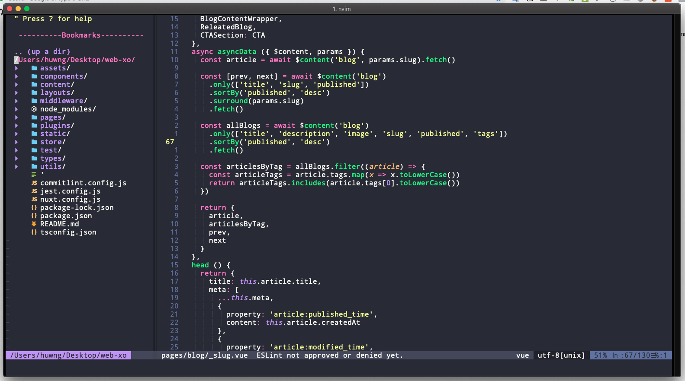
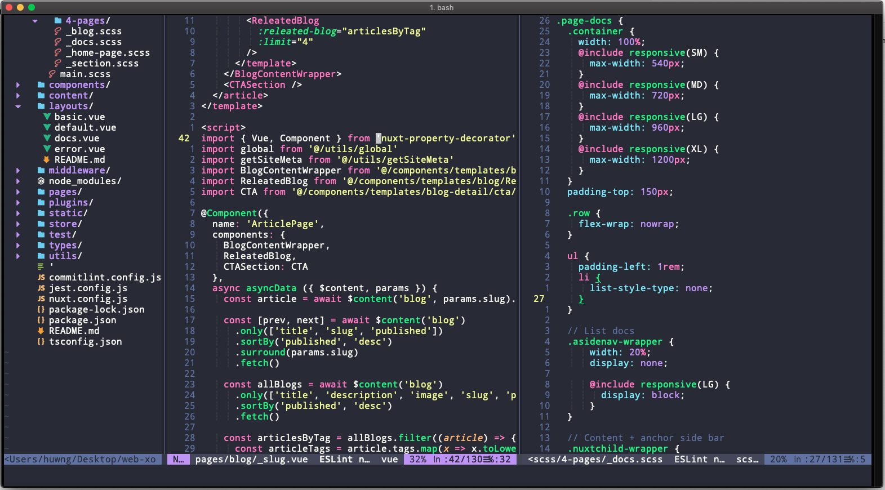
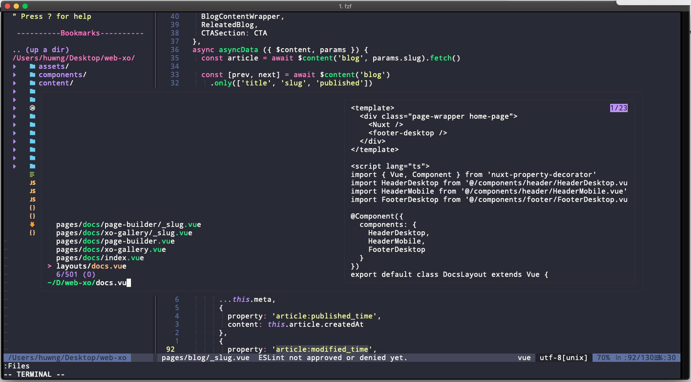
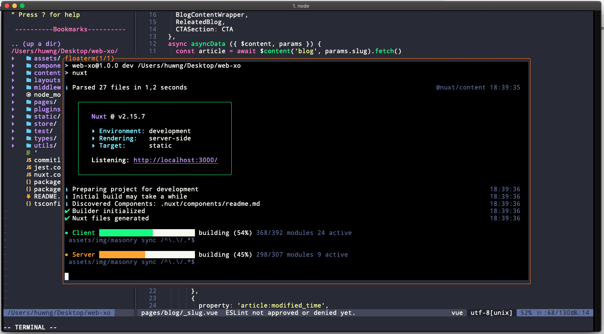

# Preview my settings
**Normal window**


**Vertical split window**


**Search all file or all word**


**Internal terminal**


# How to install 
- **Install Neovim**
1. Install Neovim

```js
// On Manjaro Linux
sudo pacman install neovim 
```

2. In root folder

```js
cd ./.config
mkdir nvim

```

3. Clone file init.vim from github to `./.config/nvim/init.vim`

4. Open terminal and run

```js
nvim
:PlugInstall
```
- **Install The Silver Search**
- **Install Nerd Font**
- **Install Python 3 Provider ( Optional )**
```js
python3 -m pip install --user --upgrade pynvim
```
[Source docs Provider](https://neovim.io/doc/user/provider.html)
- **Install Theme Check ( Shopify Dev )**
```js
// for Mac
brew tap shopify/shopify
brew install theme-check
```

# How to use
- [My maps](https://github.com/kmacoders/vim-kmacoders/blob/master/docs/MyMaps.md)
- [My notes](https://github.com/kmacoders/vim-kmacoders/blob/master/docs/MyNotes.md)
- [My settings and configs](https://github.com/kmacoders/vim-kmacoders/blob/master/docs/MySettings.md)
- [Quick tuts with Vim](https://github.com/kmacoders/vim-kmacoders/blob/master/docs/QuickTutorial.md)
